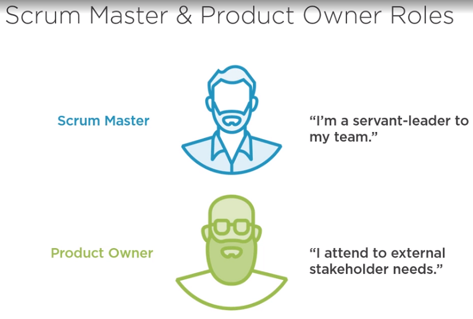

# Kinito.Scrum
Kinito.Scrum Description

# Two Team sizes

| Scrum Team | Development Team |
|------------|------------------|
| [5-11]     | [3-9]            |
| [7-9]      | [5-7]            |

# Overview 3R 5V 5E 3A

* 3 roles     3R
* 5 values    5V
* 5 events    5E
* 3 artifacts 3A

# Empirical process controls's 3 pillars as TIA

* transparency
  1. product backlog
  2. sprint backlog
* inspection
  1. by customer
  2. timed boxed events for the right people's inspection
* adaptation
  1. Scrum Events
  2. (Sprint backlog?)

# Five Scrum Values as 5V: FORCC

* Focus as restricted domain != multitask
* Openness as dialogue
* Respect as respected and respect others
* Courage as overcome challenges together
* Commitment as acheive goals doing their best

# Three Scrum Roles as 3R: SM, PO, DT

## 1 Product Owner!

Accountable for the Product Backlog & PBIs

Maximizes the value of the product by managig the value of:

* the product
* the work of the whole Scrum Team

## 1 Scrum Master!

|  |  |
-------------------|---------------------

Multi role helping and facilitating team's work.

Should let:

* decide team based decisions
* bee polinator
* experiment

Serves:

* Product Owner
* Development Team
* Organization

## n Development Team != PO & != SM but Devs, QAs, PMs, managers

Decides the PBIs to do.

Self oganized.

Defines what to accomplish and picks the PBIs to do in a sprint, not the PO not the SM.

# Five Scrum Events or time boxes as 5E

In a

## Sprint (Backlog Refinement can occur anytime)

* Sprint Planning
* Daily Scrum
* Sprint Review
* Sprint Retro

# Three Scrum artifacts as 3A

* Product Increment
* Product Backlog
* Sprint Backlog
